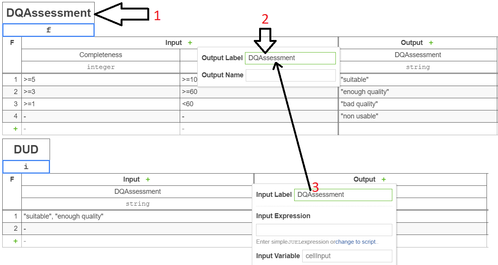

# dmn4spark


dmn4spark is a library which enables developers to use the Camunda Decision Model and Notation (DMN) in Big Data
environments with Apache Spark.

[Camunda DMN](https://camunda.com/dmn/) is an industry standard for modeling and executing decisions. Decisions are
modeled in DMN tables, a user-friendly way of modeling business rules and decision rules. The rules in the DMN table are
modeled with the Friendly Enough Expression Language ([FEEL](https://docs.camunda.org/manual/7.4/reference/dmn11/feel/)).
[*feel-scala*](https://camunda.github.io/feel-scala/) is the version which is currently supported in this library. It
provides a set of data types and built-in function for making easier the construction of decision rules. Please refer to
its documentation for 

## Versions

* dmn4spark 1.2.1. Dependencies:
  * Scala 2.12
  * Apache Spark 3.1.2
  * [Feel Engine 1.14.0](https://github.com/camunda/feel-scala/tree/1.14.0/feel-engine)
  * [Feel Engine Factory 1.14.0](https://github.com/camunda/feel-scala/tree/1.14.0/feel-engine-factory)
  * [Camunda Engine DMN 7.10.0](https://github.com/camunda/camunda-engine-dmn/tree/7.10.0)

* dmn4spark 1.1.2. Dependencies:
  * Scala 2.12
  * Apache Spark 3.0.1
  * [Feel Engine 1.14.0](https://github.com/camunda/feel-scala/tree/1.14.0/feel-engine)
  * [Feel Engine Factory 1.14.0](https://github.com/camunda/feel-scala/tree/1.14.0/feel-engine-factory)
  * [Camunda Engine DMN 7.10.0](https://github.com/camunda/camunda-engine-dmn/tree/7.10.0)

* dmn4spark 1.1.1. Dependencies:
    * Scala 2.12
    * Apache Spark 3.0.1
    * [Feel Engine 1.14.0](https://github.com/camunda/feel-scala/tree/1.14.0/feel-engine)
    * [Feel Engine Factory 1.14.0](https://github.com/camunda/feel-scala/tree/1.14.0/feel-engine-factory)
    * [Camunda Engine DMN 7.10.0](https://github.com/camunda/camunda-engine-dmn/tree/7.10.0)


* dmn4spark 1.0.0. Dependencies:
    * Scala 2.12
    * Apache Spark 2.4.0
    * [Feel Engine 1.8.0](https://github.com/camunda/feel-scala/tree/1.8.0/feel-engine)
    * [Feel Engine Factory 1.8.0](https://github.com/camunda/feel-scala/tree/1.8.0/feel-engine-factory)
    * [Camunda Engine DMN 7.10.0](https://github.com/camunda/camunda-engine-dmn/tree/7.10.0)

## Getting started

### Requirements

You need a Maven project with Scala 2.12 and Apache Spark 3.0.1.

### Importing dependencies

Add the following repository to your `pom.xml`

```xml
<repository>
    <id>ext-release-repo</id>
    <name>Artifactory-releases-ext</name>
    <url>http://estigia.lsi.us.es:1681/artifactory/libs-release</url>
    <releases><enabled>true</enabled></releases>
    <snapshots><enabled>false</enabled></snapshots>
</repository> 
```

Add the dmn4spark dependency

```xml
<dependency>
    <groupId>es.us.idea</groupId>
    <artifactId>dmn4spark</artifactId>
    <version>${version.dmn4spark}</version>
</dependency>
```

### Using the library

Then, import the `dmn4spark` implicits:

```scala
import es.us.idea.dmn4spark.spark.dsl.implicits._
```

Now, you can load your DMN tables. You just have to call the `dmn` method on any Spark Dataframe. Then, you can specify
the path to your DMN file, which might be located at:

* A local path (use the `loadFromLocalPath` method).
* Hadoop Distributed File System (HDFS) (use the `loadFromHDFS` method).
* A web server (use the `loadFromURL` method).
* Any other unsupported source. In this case, you can import the table as an `InputStream` object 
(use the `loadFromInputStream` method).

```scala
df.dmn
  .localFile("models/dmn-file.dmn")
  // or
  .hdfs("hdfs://my-hdfs/path/to/dmn-file.dmn")
  // or
  .url("https://my-webserver.com/path/to/dmn-file.dmn")
  // or
  .inputStream(inputStreamObject)
```

Then, you need to invoke the `load` the dmn in order to create a `DMNSparkDFEngine`.
This object contains the Dataframe with the data and the `DMN` which has been loaded. The method `execute()` 
creates a new Dataframe identical to the original but including the result of each DMN Table. It
means that it will add to your Dataframe as many columns as DMN Tables are in your DMN file. If you don't want to
include all the DMN Tables in the output, you can use `evaluateDecisions` in order to explicitly select the table outputs
to be included in the resulting Dataframe. By default, the columns are included in the root of the Dataframe schema. If
you want the columns generated by the decision outputs to be grouped under a column, you can use `withOutputColumn` and
specify a name for that column.

* `evaluateDecisions(decisions: String*)`: set the decisions of the DMN diagram to be evaluated. By default, all DMN tables will be 
evaluated.
* `withOutputColumn(name: String)`: if specified, the columns with the decisions outputs are grouped in a column with 
  indicated name. By default, all decision columns are appended to the root schema.
* `appendOutput()`: forces the columns with the decision outputs to be appended to the root schema. This is the behaviour
  by default.
* `activateEvaluationRuntime()`: includes a new column indicating, for each record, the time spend by the Camunda Engine to
evaluate that record. This is the option by default.
*  `deactivateEvaluationRuntime()`.

Examples: 

```scala

df
  .dmn
  .hdfs("hdfs://my-hdfs/path/to/dmn-file.dmn")
  .load.execute()

df
  .dmn
  .hdfs("hdfs://my-hdfs/path/to/dmn-file.dmn")
  .load
  .evaluateDecisions("Decision1", "Decision2")
  .execute()

df
  .dmn
  .url("https://my-webserver.com/path/to/dmn-file.dmn")
  .load
  .evaluateDecisions("Decision1", "Decision2")
  .withOutputColumn("DMNOutput")
  .execute()

```
**IMPORTANT**: Make sure that you specify the name of the Dataframe columns (or the name of the output of other DMN 
Tables) as input variables for each DMN Table. 


## Defining the DMN diagram

* DMN table name: it is employed to give name to the resulting columns in the DataFrame. In addition, if you use the
`setDecisions` method, you have to specify the decisions by means of the DMN tables (1).
* Inputs and outputs: In the case of inputs, just specify their name in the "Input Label" field (3). 
  If the input depends on the output of another DMN table, it is enough that this output is defined in the 
  "Output Labeel" field (2).




## Common DMN modelling mistakes and workarounds

We identified various common mistakes when defining DMN models for `dmn4spark`:

### #1 Input which does not match any rule

When an input does not match any rule in a DMN table, the Camunda DMN engine returns no resultks. When it occurs, 
dmn4spark prints a `null` value in the column which corresponds with that DMN table. In addition, a log like this
is produced: `[WARNING] DMNExecutor: The evaluation of the DMN Table with name (...) yielded no results`.

It might be a problem especially if a DMN table depends on the output of another table which didn't produce any result,
(see #2).

### #2 DMN table does not find an input attribute

In case a required input attribute couldn't be found, the Camunda DMN engine will throw an exception like this:

`org.camunda.bpm.dmn.feel.impl.FeelException: failed to evaluate expression 'X': no variable found for name 'X'`

It can occur when you defined an input variable, and it is not defined when evaluating a DMN table which depends on that
input. 

* (1) In case the missing variable is related to an attribute from the DataFrame, please make sure you defined it properly.
* (2) In case the missing variable is related to the output of another DMN table, please make sure that such dependency
is properly defined in the DMN diagram, and that the table which produces that variable always returns a valid value
  (see 1).

### #3 Input type mismatch

When a DMN table receives an input whose data type does not match the type declared in the table, the Camunda DMN engine
will throw an exception like this: 

`org.camunda.bpm.dmn.engine.DmnEngineException: DMN-01005 Invalid value 'NA' for clause with type 'double'.`

It might suppose a headache, especially in Big Data environments, where data generated and integrated from different
sources might return different data types.
The Camunda DMN Engine is not able to automatically cast data types. It can produce, for example, that attributes 
declared as a string the Spark DataFrame, will produce a `DmnEngineException` in case that attribute is used in a DMN
table declared as a number. 

To work-around it, we propose to cast conflicting attributes to string in the Spark DataFrame, declaring those inputs as String
in the DMN tables, and using a FEEL data type conversion function 

More informatin on FEEL functions: 
* [Camunda DMN: FEEL Language Elements](https://docs.camunda.org/manual/7.4/reference/dmn11/feel/language-elements/),
* [FEEL-Scala built-in functions](https://camunda.github.io/feel-scala/docs/reference/builtin-functions/feel-built-in-functions-conversion)

In future versions, we will support implicit and automatic data type conversions.

## Future work

* Return the attributes corresponding with the DMN tables with the data types defined there (currently the results of the
  DMN tables are always represented as strings).
* Support implicit data types conversions.
* Centralise the logging system and include the possibility of silencing them.
* Support other DMN engines.
* Support other languages for the dmn tables (e.g., `juel`)

## Licence

**Copyright (C) 2021 IDEA Research Group (TIC258: Data-Centric Computing Research Hub)**

In keeping with the traditional purpose of furthering education and research, **it is
the policy of the copyright owner to permit non-commercial use and redistribution of
this software**. It has been tested carefully, but it is not guaranteed for any particular
purposes. **The copyright owner does not offer any warranties or representations, nor do
they accept any liabilities with respect to them**.

## References

**If you use this tool, we kindly ask to to reference the following research article:**

[1] Valencia-Parra, Á., Parody, L., Varela-Vaca, Á. J., Caballero, I., & Gómez-López, M. T. (2021). DMN4DQ: When data quality meets DMN. Decision Support Systems, 141, 113450. https://doi.org/10.1016/j.dss.2020.113450

## Acknowledgements

This work has been partially funded by the Ministry of Science and Technology of Spain via ECLIPSE (RTI2018-094283-B-C33 and RTI2018-094283-B-C31) projects; the Junta de Andalucíavia the COPERNICA and METAMORFOSIS projects; the European Fund (ERDF/FEDER); the Junta de Comunidades de Castilla-La Mancha via GEMA: Generation and Evaluation of Models for dAta quality (Ref.: SBPLY/17/180501/000293), and by the Universidad de Sevilla with VI Plan Propio de Investigación y Transferencia (VI PPIT-US).